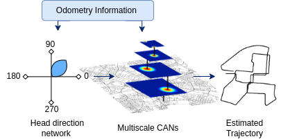

# Trajectory_Tracking_via_MCAN

This repository is an implementation of the paper 'Trajectory Tracking via Multiscale Continuous Attractor Networks' published in IROS 2023. In this research, we present Multiscale Continuous Attractor Networks (MCAN), consisting of parallel neural networks at multiple spatial scales, to enable trajectory tracking over large velocity ranges. To overcome the limitations of the reliance of previous systems on hand-tuned parameters, we present a genetic algorithm-based approach for automated tuning of these networks, substantially improving their usability. To provide challenging navigational scale ranges, we open source a flexible city-scale navigation simulator that adapts to any street network, enabling high throughput experimentation. 

The simulator extracts road network data from Open Street Maps to generate an occupancy map consisting of traversable, realistic roads. The occupied cells in the map represent the drivable areas of the road network. A path-finding distance transform algorithm, is then used to find the optimal route between two randomly generated points on the road map. Once the sample paths are generated, they can be traversed using the kinematics of a [bicycle motion model](https://github.com/winstxnhdw/KinematicBicycleModel), which is a common model used in the navigation of ground vehicles. During the traversal of the paths, motion information such as linear and angular velocities are recorded. This motion data is then used to evaluate the performance of the system, such as the accuracy of the estimated position and heading, the stability of the continuous attractor network, and the effectiveness of the buffer to prevent position resetting.

<!--  -->
