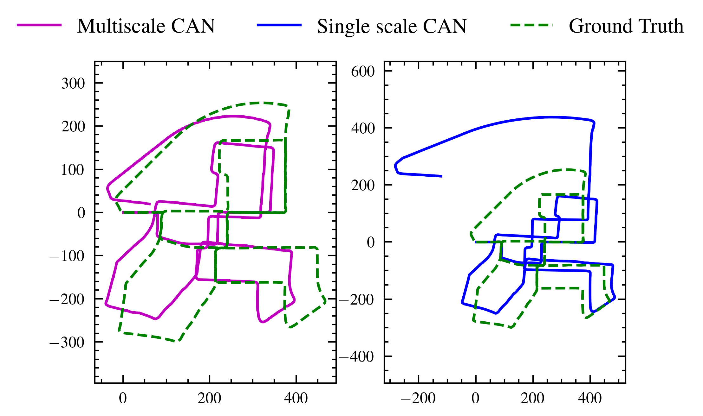

# Trajectory_Tracking_via_MCAN

This repository is an implementation of the paper 'Trajectory Tracking via Multiscale Continuous Attractor Networks' published in IROS 2023. In this research, we present Multiscale Continuous Attractor Networks (MCAN), consisting of parallel neural networks at multiple spatial scales, to enable trajectory tracking over large velocity ranges. To overcome the limitations of the reliance of previous systems on hand-tuned parameters, we present a genetic algorithm-based approach for automated tuning of these networks, substantially improving their usability. To provide challenging navigational scale ranges, we open source a flexible city-scale navigation simulator that adapts to any street network, enabling high throughput experimentation. 

<!--  -->
